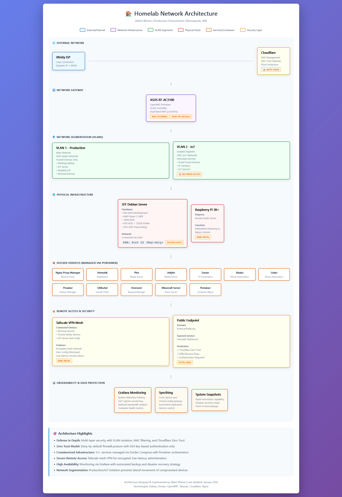

markdown file explaining structure of my network - needs revision
# 🏠 Homelab Infrastructure

> **Production-grade home server environment with enterprise security practices**

[](https://opensource.org/licenses/MIT)
[](https://www.docker.com/)
[](https://www.debian.org/)
[](https://openwrt.org/)

---

## 📋 Table of Contents

- [Overview](#-overview)
- [Network Architecture](#️-network-architecture)
- [Infrastructure Components](#️-infrastructure-components)
- [Security Implementation](#-security-implementation)
- [Services & Applications](#-services--applications)
- [Remote Access](#-remote-access)
- [Monitoring & Observability](#-monitoring--observability)
- [Hardware Specifications](#-hardware-specifications)
- [Future Enhancements](#-future-enhancements)

---

## 🎯 Overview

This repository documents my production homelab environment, designed with enterprise-grade security practices and modern infrastructure patterns. The setup emphasizes:

- **Defense in Depth**: Multi-layer security architecture
- **Network Segmentation**: VLAN isolation for trusted/untrusted devices
- **Zero Trust**: Deny-by-default posture with granular access control
- **High Availability**: Automated monitoring, backup, and disaster recovery
- **Infrastructure as Code**: Containerized services with declarative configuration

**Live Dashboard**: [home.unfunky.xyz](https://home.unfunky.xyz) (Protected by Cloudflare Zero Trust)

---

## 🗺️ Network Architecture



### Architecture Layers

```
Internet (Xfinity ISP)
    ↓
Cloudflare (DNS + Zero Trust + DDoS Protection)
    ↓
ASUS RT-AC3100 (OpenWRT, VLAN Controller, WiFi)
    ↓
├─ VLAN 1 (Production) ──→ SFF Server + Raspberry Pi + Trusted Devices
└─ VLAN 2 (IoT) ──────────→ Smart Home Devices (Isolated)
    ↓
Docker Services (12+ Containers)
    ↓
Tailscale Mesh VPN (Secure Remote Access)
```

### Key Design Decisions

| Decision | Rationale |
|----------|-----------|
| **VLAN Segmentation** | Isolates untrusted IoT devices from production network, preventing lateral movement |
| **OpenWRT Firmware** | Enhanced control over routing, VLANs, and firewall rules compared to stock firmware |
| **Tailscale over Traditional VPN** | Zero-config WireGuard mesh, no port forwarding, encrypted peer-to-peer connections |
| **Containerization** | Easier service management, version control, and disaster recovery |
| **SSH Key-Only Auth** | Eliminated password-based SSH attacks entirely (100% key-based authentication) |

---

## 🏗️ Infrastructure Components

### Network Gateway
- **Router**: ASUS RT-AC3100 running OpenWRT
- **Features**:
  - VLAN tagging and inter-VLAN firewall rules
  - Dual-band WiFi (2.4GHz + 5GHz) with separate SSIDs per VLAN
  - MAC address filtering with deny-by-default posture
  - DHCP reservations for static internal IPs

### Physical Hosts

#### SFF Debian Server
**Custom-built x86 server for 24/7 operation**

| Component | Specification |
|-----------|---------------|
| **Motherboard** | MSI B450 |
| **CPU** | AMD Ryzen 5 2600 (6C/12T) |
| **RAM** | 16GB DDR4 |
| **Storage** | 6TB HDD (media) + 120GB NVMe (system/Docker) |
| **GPU** | Dedicated GPU for hardware-accelerated transcoding |
| **OS** | Debian 12 (Bookworm) |
| **Network** | Gigabit Ethernet (LAN1 on router) |

**Build Notes**: Performed full hardware migration including motherboard swap, NVMe integration, and GPU installation for Plex/Jellyfin transcoding offload.

#### Raspberry Pi 3B+
- **Purpose**: Moode Audio Server for networked audio streaming
- **Connection**: Outputs to legacy receiver via analog/digital audio
- **Network**: Wired Ethernet on Production VLAN

---

## 🔐 Security Implementation

### Network Security

#### Firewall Configuration
```
Default Policy: DENY ALL
Allowed Inbound: SSH (key-only), HTTP/HTTPS (via NPM)
Allowed Outbound: Whitelisted destinations only
Inter-VLAN: Production → IoT (blocked), IoT → Production (blocked)
```

#### Access Control Mechanisms
- **MAC Filtering**: Deny-by-default whitelist on both VLANs
- **SSH Hardening**: 
  - Password authentication disabled globally
  - Root login disabled
  - Key-based authentication only (4096-bit RSA)
  - Custom fail2ban rules (planned)
- **Cloudflare Zero Trust**: Application-layer authentication for public endpoints
- **Nginx Proxy Manager**: Centralized reverse proxy with SSL/TLS termination

### Attack Surface Reduction

| Exposure | Mitigation |
|----------|------------|
| **Public SSH** | Disabled. SSH only via Tailscale or local network |
| **Open Ports** | Only 80/443 exposed, proxied through Cloudflare |
| **IoT Devices** | Isolated VLAN, no access to production resources |
| **Weak Passwords** | Eliminated entirely (key-based auth everywhere) |

---

## 📦 Services & Applications

All services run as Docker containers managed via **Docker Compose** and orchestrated through **Portainer**.

### Media Stack
| Service | Purpose | Access Method |
|---------|---------|---------------|
| **Plex** | Media streaming with HW transcoding | Internal + Tailscale |
| **Jellyfin** | Open-source media server (Plex alternative) | Internal + Tailscale |
| **Sonarr** | TV show automation and monitoring | Internal |
| **Radarr** | Movie automation and monitoring | Internal |
| **Lidarr** | Music automation and monitoring | Internal |
| **Prowlarr** | Indexer manager for *arr suite | Internal |
| **SABnzbd** | Usenet downloader | Internal |
| **Overseerr** | Media request management | Internal + Tailscale |

### Infrastructure Services
| Service | Purpose | Access Method |
|---------|---------|---------------|
| **Nginx Proxy Manager** | Reverse proxy with SSL management | Internal |
| **Heimdall** | Application dashboard | **Public** (via home.unfunky.xyz) |
| **Portainer** | Docker container management UI | Internal |
| **Grafana** | System monitoring and telemetry | Internal |

### Game Servers
| Service | Purpose | Access Method |
|---------|---------|---------------|
| **Minecraft Server** | Multiplayer game server | Port-forwarded (25565) |

### Configuration Management
- **Docker Compose**: Declarative service definitions
- **Portainer Stacks**: Visual stack management and updates
- **YAML configs**: Version-controlled service configurations

---

## 🌐 Remote Access

### Tailscale VPN Mesh Network

**Architecture**: Peer-to-peer encrypted mesh using WireGuard protocol

**Connected Devices**:
- SFF Debian Server (exit node)
- Personal laptop
- Personal phone
- Trusted family devices (limited)

**Advantages over Traditional VPN**:
- No central server bottleneck
- Automatic NAT traversal (no port forwarding)
- Sub-50ms latency for remote administration
- Direct peer-to-peer connections when possible
- Automatic key rotation and certificate management

**Use Cases**:
- Remote SSH access to server
- Access to internal web services (Plex, Portainer, etc.)
- Network-level access to Production VLAN when traveling

---

## 📊 Monitoring & Observability

### Current Implementation

#### Grafana Dashboards
- **System Telemetry**: CPU, RAM, disk I/O, network throughput
- **Uptime Tracking**: 24/7 availability monitoring
- **Container Health**: Per-service resource consumption
- **Network Bandwidth**: Real-time traffic analysis

### Data Protection Strategy

#### Backup Architecture
```
Tier 1: System Snapshots (Rapid Recovery)
  └─ Full filesystem snapshots for quick rollback
  
Tier 2: Syncthing (Configuration Sync)
  └─ Automated sync of Docker configs, scripts, critical files
  └─ Multi-device replication (Server ↔ Laptop)
  
Tier 3: External Backup (Planned)
  └─ Off-site backup to cloud storage
```

#### Recovery Time Objective (RTO)
- **Critical Services**: < 15 minutes (from snapshots)
- **Full System**: < 1 hour (bare metal reinstall + restore)

---

## 💻 Hardware Specifications

### Server Build Details

**Custom SFF Server**
- **Form Factor**: Small Form Factor (SFF) for space efficiency
- **Power Consumption**: ~80W idle, ~150W under load
- **Cooling**: Aftermarket CPU cooler + case fans (optimized airflow)
- **Uptime**: 99.5%+ (monitored via Grafana)

**Storage Configuration**:
```
/dev/nvme0n1 (120GB) - System partition + Docker volumes
/dev/sda1 (6TB)      - Media library (Plex/Jellyfin)
```

**Network Configuration**:
```
eth0: 192.168.1.x/24 (Production VLAN)
tailscale0: 100.x.x.x/32 (Mesh VPN)
```

### Network Equipment

**ASUS RT-AC3100**
- **CPU**: Broadcom BCM4709C0 (1.4GHz dual-core)
- **WiFi**: AC3100 (2167 Mbps @ 5GHz + 1000 Mbps @ 2.4GHz)
- **Ports**: 4x Gigabit LAN + 1x Gigabit WAN
- **Firmware**: OpenWRT 23.05

---

## 🚀 Future Enhancements

### Short-Term (1-2 Weeks)
- [ ] Implement Fail2Ban with email/Telegram alerts
- [ ] Deploy Prometheus + extended Grafana dashboards
- [ ] Set up automated backup scripts with off-site replication
- [ ] Add security audit logging (Lynis, ClamAV)

### Medium-Term (1-2 Months)
- [ ] Migrate to Infrastructure as Code (Ansible playbooks)
- [ ] Implement centralized logging (Loki + Promtail)
- [ ] Add UPS with automatic graceful shutdown
- [ ] SSL/TLS certificate automation with Let's Encrypt

### Long-Term (3-6 Months)
- [ ] Expand to multi-node Docker Swarm or Kubernetes cluster
- [ ] Implement GitOps workflow for service deployments
- [ ] Add network intrusion detection system (Suricata/Snort)
- [ ] Build custom dashboard with live infrastructure status

---

## 📚 Documentation

### Configuration Examples

Docker Compose snippets, firewall rules, and network configs will be added to the `/docs` directory as this repository evolves.

**Planned Documentation**:
- OpenWRT VLAN configuration guide
- Docker Compose service templates
- Tailscale setup and mesh configuration
- Disaster recovery runbook

---

## 📞 Contact

**Albert Weiner**  
📧 ajgreenboy@gmail.com  
🔗 [LinkedIn](https://www.linkedin.com/in/al-weiner-29865529a/)  
💻 [GitHub](https://github.com/ajgr33nboy)  
🌐 [Portfolio](https://unfunky.xyz)

---

## 📄 License

This project is documented under the MIT License. See [LICENSE](LICENSE) for details.

---

## 🙏 Acknowledgments

- **OpenWRT Community** for robust router firmware
- **Tailscale** for simplifying secure remote access
- **Cloudflare** for DNS and Zero Trust services
- **LinuxServer.io** for excellent Docker container images
- **r/homelab** community for inspiration and troubleshooting help

---

<div align="center">
  <sub>Built with ❤️ in Minneapolis, MN</sub>
</div>
